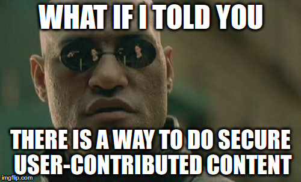

# Defeating the npm worm (DRAFT)

## The threat

There is a security vulnerability in [npm](https://www.npmjs.com/) by default that enables writing a [worm](https://en.wikipedia.org/wiki/Computer_worm) that can propagate to anyone doing an `npm install` to a package that would contain an infected dependency (even if the dependency is deep).

[More on](https://www.kb.cert.org/vuls/id/319816) [this topic](http://www.infoq.com/news/2016/03/npm-infection)

This threat uses a combinaison of elements:

1. `npm install` installs a package and all its dependencies (and deeply) by default
2. `npm install --save` makes that by default, dependency versions accept any later [patch version](http://semver.org/#summary) of the same package
3. `npm install`, by default, runs all [lifecycle scripts](https://docs.npmjs.com/misc/scripts#description) of all dependencies and these can be arbitrary bash commands
4. `npm login`, by default, saves the authentication credentials in `$HOME/.npmrc`.
5. By default, published packages are actually published without review
6. Arbitrary npm lifecycle scripts bash commands have, by default, full authority over the installer computer. This includes scanning the person's hardrive, find all their node projects, modify them to add worm propagation code as a lifecycle script and then run `npm version patch ; npm publish`.

Through the annoying and repeated use of "by default", the reader understands that if a worm is sent to npm, it will propagate because most people don't change defaults. Point 5 listed an example of what the worm can do to propagate, but of course once you have arbitrary access to the machine, [you can just encrypt their disk and ransom for a bitcoin against giving back the data](https://en.wikipedia.org/wiki/CryptoLocker).

This is serious.

## NPM response and defense against a worm

[NPM response](http://blog.npmjs.org/post/141702881055/package-install-scripts-vulnerability) has been considered weak by some. It is. It does not change any default settings, so the threat is not really being addressed.

### Users should opt-in for security

npm recommands an opt-in defense which is running `npm install --ignore-scripts` which disables lifecycle scripts. [It is suggested elsewhere](https://www.kb.cert.org/vuls/id/319816) to do `npm shrinkwrap` to lock down dependencies or to log out systematically after having published. These are also an opt-in.

### Crowdsourced package inspection

> npm cannot guarantee that packages available on the registry are safe. If you see malicious code on the registry, report it to support@npmjs.com and it will be taken down.

So, after the fact, when users machine have been infected by a worm npm takes the malicious package down? Too late, but thanks, lol!

As soon as a package is infected, people installing it will have their machines infected. npm cannot accept to be used to affect others machines. Even if npm maybe limits the propagation, malicious packages will be sent to npm.
Maybe the next person disatisfied with a name dispute resolution "owning" another heavily-dependend module will send malicious patch updates [instead of just unpublishing them](https://medium.com/@azerbike/i-ve-just-liberated-my-modules-9045c06be67c)
As packages will be more valuable, their author will be more likely to become targets of various attacks. Maybe someone will pay an author for the ownership of a module that's heavily dependend on to distribute malware. This has happened with [Chrome extensions](http://arstechnica.com/security/2014/01/malware-vendors-buy-chrome-extensions-to-send-adware-filled-updates/), no reason this won't happen with npm especially as long as there is no trust model for authors.

### Defense against a "quick" worm

> npm monitors publish frequency. A spreading worm would set off alarms within npm, and if a spreading worm were identified we could halt all publishing while infected packages were identified and taken down.

What about a [patient worm](patient worm design.md)? The publication frequency is exactly the same as the normal frequency and discrecy makes it hard to detect on users machines as well as hard to detect which packages are infected on npm. You can start playing the [virus signature game](https://en.wikipedia.org/wiki/Computer_virus#Self-modification) but attack is always a step ahead of defense in this game and it'd be a massive amount of resources spent only on this problem. Blaaah...

## Security **by default**

Software should be secure by default, not an opt-in.

People who are coming to npm today and tomorrow have missed the blogposts and tweets. They won't opt-in,  they'll be infected.

People who reinstall node/npm will forget to opt-in. They'll be infected.

I am sorry, but the current insecure-by-default state of npm is irresponsible. Some default needs to be changed.

### But which default should be changed? 

Let's review the list above:

1. Sort of the very point of `npm install`, let's keep this default.
2. Accepting patch versions: Hey, super useful when a module has a security patch! Removing this default pretty much means choosing a threat against another; a choice no one should ever have to make. This default remains.
3. [It's been suggested that removing lifecycle scripts would help security](https://twitter.com/feross/status/713602268403081216). Sure it does, but then you have to run the lifecycle scripts manually because they're useful. Oh! And by the way, you're infected by a worm if you don't review all of them before you run them! No sure the security would be improved that much. This default remains.
4. Removing this default means logging in every time. Arguably a Denial-Of-Service attack against the user ([credit for the joke](https://youtu.be/UH66YrzT-_M?t=347)). There is no reason to give up usability for the sake of security.
5. This one can be debated. Complicated topic. I'm on the side of keeping things as they are today. It's like the web. Anyone can publish, no authorizations required and in any case, it's not economically tenable to not pay for npm and expect them to review packages manually
6. well... last element in the list, so I guess that's the default I should address :-p

People I don't necessarily trust a lot write scripts, post them as lifecycle scripts on npm and that runs on my machine. Why on Earth would these scripts have access to my entire filesystem, by default? This is an insane amount of authority to give to random scripts downloaded from npm, who themselves tell us they "cannot guarantee that packages available on the registry are safe".

> Quite often, we have enough context to know that things look really alarming from the outside are really not that big a deal or rather are no bigger deal than is already there and in an unfixable way in the CLI; the package script vulnerability is a good example of that. That's just a cost of doing business with user-contributed content.

[Forrest Norvell during a recent npm CLI team meeting](https://www.youtube.com/watch?v=xFGIvkwEDKo&feature=youtu.be&t=1839)

Red pill coming your way.

#### Aside on capability security 

Like the joke above, I'm only parroting the words of others here.

* https://youtu.be/UH66YrzT-_M?t=227
* https://www.youtube.com/watch?v=eL5o4PFuxTY
* https://www.youtube.com/watch?v=vrbmMPlCp3U

(these talks are long, but there're worth your time, I promise. I have others if you're interested)

The folks in these videos have good metaphors for the state of software security. One of my [favorite quote comes from Marc Stiegler](https://youtu.be/eL5o4PFuxTY?t=3913):

> Buffy Summers! In Season 3, her mother makes the criticism that every security person needs to pay attention to! Joyce says to Buffy: "but what's your plan? you go out every day, you kill a bunch of bad guys and then the next day there is more bad guys. You can't win this way. You need a plan."
And finally, Buffy in the last episode of the last season comes up with a plan: she changes the fundamental physics of her Universe to permanently favor the defender.
> 
> What could be lazier than forcing the other guy to play by your rules?

Why are we running commands that, by default, have the authority to publish npm packages on our behalf? We're playing the attacker game. Any npm command and lifecycle script should only have the authority to do its job and no more.

But how?

## Secure-by-default lifecycle scripts

The first step is defining the appropriate amount of authority that lifecycle scripts should have.
What are legitimate usages of lifecycle scripts? We can start with the following list:
* build things (like compile coffeescript scripts or compile some C++ to make a C++ Node module) and put it *somewhere in the project directory*

(yes there is a single item, let's have a discussion on what that list should be)

So the lifecycle script needs read-write authority over the project directory. Cool! Let's give it **only** access to this specific directory and no other files!
...wait! Why does it have write authority over `package.json`? Never heard of a build script that needs to modify `package.json`, let's only give read-only authority over this file and read-write over the rest.

### Proof-of-concept of a how

I have a proof of concepts of this in the [contained-node repo](https://github.com/DavidBruant/contained-node) (sorry it's a bit of a mess right now). It uses [Docker](https://docs.docker.com/) because it was easy for me to write. Smarter people with more time on their hand will find more subtle solutions. The only point I'm trying to make is that it's possible, not that my quick implementation should be used or even a reference.

In the end, what happens is that if you run `npm install https://github.com/DavidBruant/harmless-worm/tarball/master --save`, what happens is:
* npm download the dependency
* it is saved under `node_modules`
* the `postscript` script runs and modifies `package.json` in a scary way
* npm modifies `package.json` to add `worm` in the `dependencies` field

But when you run `./bin/containednpm install https://github.com/DavidBruant/harmless-worm/tarball/master --save`, what happens is:
* (same)
* (same)
* the `postscript` fails to edit `package.json` because it only has access to a read-only version
It would also fail to read your `$HOME` because it runs in a docker container and nobody gave access your `$HOME` to this container
* (same)

I have to mention that there is zero copy happening. The `package.json` that the contained lifecycle scripts see is the actual one. The creation of the `node_modules` directory happens in the right directory directly, no temporary directory, etc. None of this is magics. Docker does the heavy lifting and I'm just sitting on these shoulders.

What happens if the lifecycle encrypts the filesystem and want to ransom for a bitcoin? It succeeds... inside the docker container which contains few valuable data (only the project you're working on, hopefully, it's versionned so you may not care too much losing it on this computer)... container that is discarded at the end of the `./bin/containednpm` command.
In any case, all your other projects, your browser history, your emails and your `$HOME` are safe without having you to pay back for them. My pleasure.

That's the way we can change the rules of the game permanently in favor of the defender.
It's possible to be **a lot** more secure when "doing business with user-contributed content".

#### Aside

When I started this work and this blogpost, I was planning on only talking about the technical bits about how I smartly used a combination of [docker](https://docs.docker.com/), [docker-in-docker](https://blog.docker.com/2013/09/docker-can-now-run-within-docker/), [dynamic docker volume swap](https://jpetazzo.github.io/2015/01/13/docker-mount-dynamic-volumes/), [dirty $PATH hacks](https://github.com/DavidBruant/contained-node/blob/fc0f1bff944249ca660d264394a7c490e4ad8a91/bin/containednpm#L8-L11) based on the fragile assumption than [lifecycle are started with `sh -c`](https://github.com/npm/npm/blob/1310b5f17bf7d279083142724005a5b385df50e0/lib/utils/lifecycle.js#L216-L217), etc.

But none of that matters. This is just a defense POC. It's possible, I did it, let's have the other more important discussion instead.

I'm happy to make another blog post to explain the technical details (they should be straightforward to anyone familiar with docker and unix command line) or maybe get in a call or answer emails.

## Beyond a POC

> Hey great work on the POC! I'm going to install your POC so my `npm` and `node` are safe by default!

(fictional quote)

My pleasure! This still needs more polishing but it's good there is another secure opt-in against the worm and associated threats!

Regardless of the level of polishing, this defense will remain an opt-in and we need to change the defaults. This work needs to be merged into the official npm client to be any useful at scale. Security should not be an opt-in.

### Plan of action

Security should not be an opt-in, so npm needs to be on-board otherwise, this is just yet another opt-in and does not really solve the problem.

#### On my side

1. Get some form of acknowledgment from the npm folks that the current default is insecure
2. Get some form of acknowledgment that npm should be secure by default
3. Get some form of acknowledgment that what is being discussed in this blogpost (containing lifecycle scripts) is an option that is worth exploring

#### Exploration and path to becoming default

Assuming there is interest in the exploration:

0. Polish the [contained-node repo](https://github.com/DavidBruant/contained-node) to make it easier to reproduce the defense POC. (I'll do this anyway)
1. Make an initial list of legitimate authority that lifecycle scripts should have by default
2. Figure out UX experience and what are the appropriate tools for implementation (currently, `bin/containednpm` uses docker and requires `sudo` privilege which is absurd. There are probably other tools for containement that don't require this and requiring everyone who wants node/npm to install Docker is a ridiculous requirement anyway)
3. Add that to the `npm cli` under a `--safe` flag (opt-in)
4. Try lots of modules and notice the differences between `npm install` and `npm install --safe`. Each difference certainly means that the lifecycle scripts implicitely ask for authority that it hasn't been granted. Decide then whether:
    * the lifecycle script uses legit authority => expand the default authority to cover the new use case
    * the lifecycle script uses authority that it shouldn't need => contact author for more info to figure out whether it's legit, maybe send a PR to reduce the authority required, maybe it's a malicious package and just remove it from the registry
5. After a good year (or more? or less?) of the previous step, `npm install` becomes `npm install --unsafe` and `npm install --safe` becomes the default behavior of `npm install`.

Bim! Secure default! And no major disruption for anyone. `--unsafe` provides a fallback if you want to get wormed or ransomed, but at least, you're opting-in for being attacked! That's a much better news for everyone else.

I have to note that there is a cost related to having to maintain the list of default authority over time. I doubt it will be too much, but I know it cannot be zero.

Additionally, this default behavior for the CLI acts as negative incentive for anyone who'd want to publish malicious packages. If they know it won't work for the majority of people, they'll certainly try something else.

